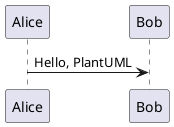

# VitePress 功能更新-1

为了后续的使用更加方便，本次为网站带来了两处更新：

- 支持侧边栏排序并自动移除前置序号
- 支持渲染 PlantUML 的代码块

## 侧边栏排序

在此次更新之前，侧边栏为自动生成，导致文章的展示顺序不可控，于是本次更新为侧边栏添加了排序功能。为了更加美观，文件名前的序号也会自动被移除：

```ts
// .vitepress/utils/genSidebar.ts

/**
 * 递归遍历目录生成侧边栏项
 */
function generateSidebarItems(directory: string, basePath: string): SidebarInfo {
  // 侧边栏项
  const sidebarItems: DefaultTheme.SidebarItem[] = []
  // 该目录是否可点击
  let folderLink = fs.existsSync(path.join(directory, 'index.md'))
    ? generateLink(directory, basePath) + '/'
    : null

  const filesAndDirs = fs.readdirSync(directory, { withFileTypes: true })
  filesAndDirs.sort((a, b) => a.name.localeCompare(b.name)) // [!code ++]
  filesAndDirs.forEach(dirent => {
    const fullPath = path.join(directory, dirent.name)
    if (dirent.isDirectory()) {
      // 如果是目录则递归调用
      const directoryItems = generateSidebarItems(fullPath, basePath)
      if (directoryItems.sidebarItems.length > 0) {
        sidebarItems.push({
          text: dirent.name.replace(/^\d+\./, ''), // [!code ++]
          ...(directoryItems.folderLink ? { link: directoryItems.folderLink } : {}),
          items: directoryItems.sidebarItems
        })
      }
    } else if (path.extname(dirent.name) === '.md' && dirent.name !== 'index.md') {
      // 如果是 Markdown 文件则添加到数组
      const text = path.basename(dirent.name, '.md').replace(/^\d+\./, '') // [!code ++]
      sidebarItems.push({
        text, link: generateLink(fullPath, basePath)
      })
    }
  })

  return { sidebarItems, folderLink }
}
```

## 渲染 PlantUML

为了后续能更方便的制作展示各类 UML 图表，本次更新为 markdown-it 添加了对 [PlantUML](https://plantuml.com/zh/) 的支持，使得通过简单的语法就能创建各类图表（类似的工具还有基于 JavaScript 的 [Mermaid](https://mermaid.js.org/)）

虽然存在插件实现了类似功能，如 [@mdit/plugin-uml](https://mdit-plugins.github.io/zh/uml.html)，但它们主要适用代码块之外的 PlantUML 语法，对于写在代码块内的更通用情况却没有支持，于是自己实现了该功能的插件：

```ts
// .vitepress/utils/plantUMLPlugin.ts
const server = 'https://www.plantuml.com/plantuml/svg'

/**
 * PlantUML 渲染插件
 */
export function plantUMLPlugin(md: MarkdownIt): void {
  const defaultRender = md.renderer.rules.fence

  md.renderer.rules.fence = (tokens, idx, options, env, self) => {
    const token = tokens[idx]

    // 检查是否为 PlantUML 代码块
    if (token.info.trim() === 'plantuml') {
      // 将原内容编码并返回渲染后的图片标签
      const content = token.content.trim()
      const encoded = encode(content)
      return `<p></p>`
    }

    // 非 PlantUML 代码块则使用默认渲染方式
    return defaultRender(tokens, idx, options, env, self)
  }
}
```

通过修改 `fence` 的 `Renderer`，也就是代码块对应的渲染器，使其处理 `plantuml` 语言的代码块时能够拥有额外逻辑：

- 获取代码块里的内容
- 使用 `plantuml-encoder` 对其进行编码转换
- 以 `PlantUML 服务器/图像格式/内容编码` 为格式进行拼接，形成图像的 URL
- 将 URL 包装在 `` 标签内并返回

这样当 markdown-it 检测到 `plantuml` 语言的代码块时，就会自动转换为对应的 SVG 图像

例如下面的语法：

```
@startuml
Alice -> Bob : Hello, PlantUML
@enduml
```

会被渲染为如下的图像：


