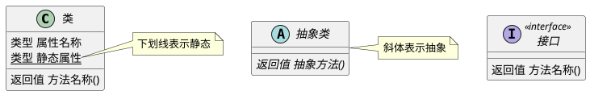
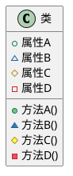
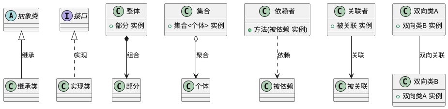
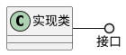

# UML 类图

在系统学习设计模式之前，有必要首先了解 UML 类图，这样才能更方便直观的理解各个类的组成及关系，以下是对 UML 类图的简单介绍

## 基本元素

- **类:** 矩形框内分为名称、属性、方法三部分，使用横线分隔
- **接口:** 在名称顶部标注 `<<interface>>`（由于名称旁已标明类型，后续将省略）
- **静态属性 / 静态方法:** 使用下划线表示
- **抽象类 / 抽象方法:** 使用斜体表示

## 可访问性

类中的访问控制修饰符，通常在 UML 类图中使用符号 `+`、`~`、`#`、`-` 表示，但在本站中使用图标表示，属性为空心、方法为实心，具体对应关系如下：

| 符号  |                   图标                    |    修饰符    |
|:---:|:---------------------------------------:|:---------:|
| `+` |  ●  |  public   |
| `~` |  ▲  |  default  |
| `#` |  ◆  | protected |
| `-` |  ■  |  private  |

## 关联关系

- **继承:** 子类继承了父类的行为结构，即 `extends`
- **实现:** 类实现了某个接口，即 `implements`
- **组合:** 强关联关系，二者不能独立存在，生命周期相同（如公司由多个部门组合而成）
- **聚合:** 弱关联关系，个体可以脱离集合而存在（如森林由多个树木聚合而成）
- **依赖:** 通常在方法中体现依赖关系
    1. **参数依赖:** 类 A 的某个方法接受类 B 的实例作为参数
    2. **局部变量依赖:** 类 A 的某个方法内部创建或使用了类 B 的实例
    3. **返回值依赖:** 类 A 的某个方法返回类 B 的实例
- **关联:** 通常在属性中体现关联关系，知晓对方且可独立存在
- **双向关联:** 同上，只是双方都与对方有关联关系

::: details 实现接口的另一种表现形式

**棒棒糖表示法:** 圆圈旁为接口名称，因形似棒棒糖而得名

:::
